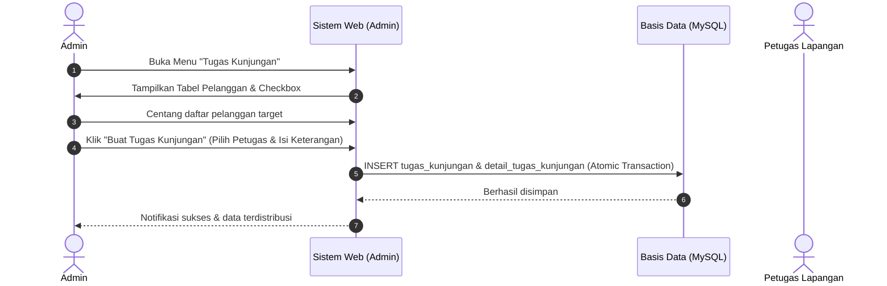
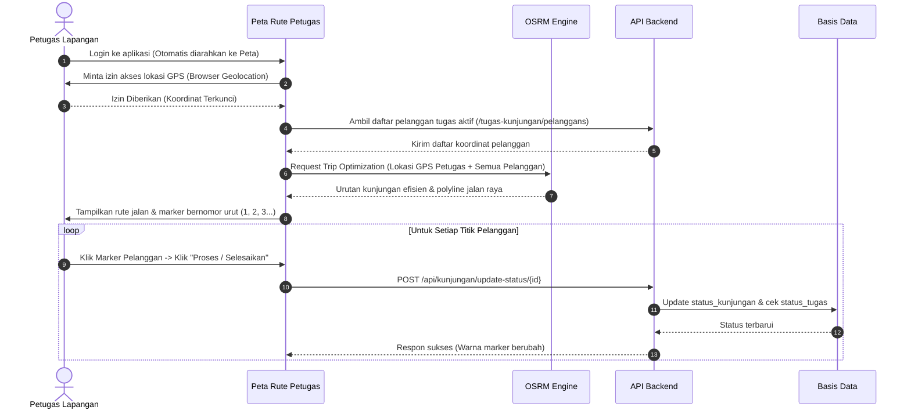

# Panduan Peran Pengguna & Alur Kerja

Dokumen ini menjelaskan matriks hak akses pengguna (*User Roles*), alur operasional pembuatan tugas, pelaksanaan kunjungan di lapangan, serta pemantauan pelaporan.

---

## 1. Matriks Peran Pengguna (Roles Matrix)

Aplikasi memiliki 2 (dua) tingkat peran utama:

| No | Modul / Fitur | Admin | Petugas Lapangan | Penjelasan Hak Akses |
|:---|:---|:---:|:---:|:---|
| 1 | **Dashboard Statistik** | ✅ | ❌ | Ringkasan total pelanggan, daya terpasang, grafik tarif & sebaran daya. |
| 2 | **Manajemen Data Pelanggan** | ✅ | ❌ | Tambah manual, edit identitas & koordinat, hapus pelanggan. |
| 3 | **Impor Excel Pelanggan** | ✅ | ❌ | Upload file Excel dengan indikator progress bar asinkron. |
| 4 | **Peta Sebaran Pelanggan (Global)** | ✅ | ❌ | Melihat seluruh titik pelanggan PLN se-wilayah operasional. |
| 5 | **Pembuatan Tugas Kunjungan** | ✅ | ❌ | Memilih kumpulan pelanggan dan menugaskan ke petugas tertentu. |
| 6 | **Peta Rute Tugas & Navigasi TSP** | ❌ | ✅ | Navigasi panduan rute optimal OSRM dari GPS petugas ke tiap pelanggan. Admin hanya memantau titik lokasi, tidak memiliki fitur pembuatan rute navigasi. |
| 7 | **Update Status Kunjungan** | ✅ | ✅ | Memperbarui status kunjungan (`belum_dikunjungi` ➔ `diproses` ➔ `sudah_dikunjungi`). |
| 8 | **Daftar Tugas Kunjungan** | ✅ *(Semua)* | ✅ *(Milik Sendiri)* | Admin melihat seluruh tugas tim; petugas hanya melihat tugas pribadinya. |
| 9 | **Cetak & Filter Laporan PDF** | ✅ | ❌ | Menyaring riwayat kunjungan berdasarkan tanggal dan mengekspor dokumen resmi. |
| 10 | **Manajemen Profil** | ✅ | ✅ | Mengubah nama, email, dan kata sandi akun masing-masing. |

---

## 2. Alur Kerja Operasional (Business Flow)

### 2.1. Alur Pembuatan Tugas Kunjungan (Admin)

1. **Seleksi Pelanggan**: Admin mengakses menu `Tugas Kunjungan` (`/tugas-kunjungan`).
2. **Multi-Select**: Admin mencentang satu atau banyak pelanggan pada tabel interaktif DataTables.
3. **Penetapan Penugasan**: Menekan tombol `Buat Tugas Kunjungan`, memilih akun Petugas Lapangan yang ditugaskan, serta memasukkan catatan instruksi/keterangan pekerjaan.
4. **Penyimpanan Transaksional**: Sistem secara atomik membuat entri pada tabel induk `tugas_kunjungan` dan entri jamak pada `detail_tugas_kunjungan`.

---

### 2.2. Alur Pelaksanaan Kunjungan Lapangan (Petugas)

1. **Akses Langsung**: Saat petugas lapangan melakukan login, sistem secara otomatis mengarahkannya langsung ke antarmuka peta tugas (`/tugas-kunjungan/map`).
2. **Deteksi GPS**: Petugas mengizinkan akses lokasi perangkat agar sistem dapat menentukan titik awal keberangkatan.
3. **Perhitungan Rute Pintar**: Algoritma TSP OSRM menyusun urutan perjalanan terpendek dan tercepat menghindari rute bolak-balik.
4. **Pembaruan Status di Lapangan**:
   - Status awal: `belum_dikunjungi` (Marker Biru).
   - Saat petugas menuju lokasi / memeriksa: Klik tombol ubah status menjadi `diproses` (Marker Kuning).
   - Setelah selesai penanganan: Klik tombol ubah status menjadi `sudah_dikunjungi` (Marker Hijau).
5. **Penyelesaian Otomatis**: Ketika seluruh pelanggan dalam penugasan telah berstatus `sudah_dikunjungi`, status induk penugasan otomatis berganti menjadi `selesai`.
