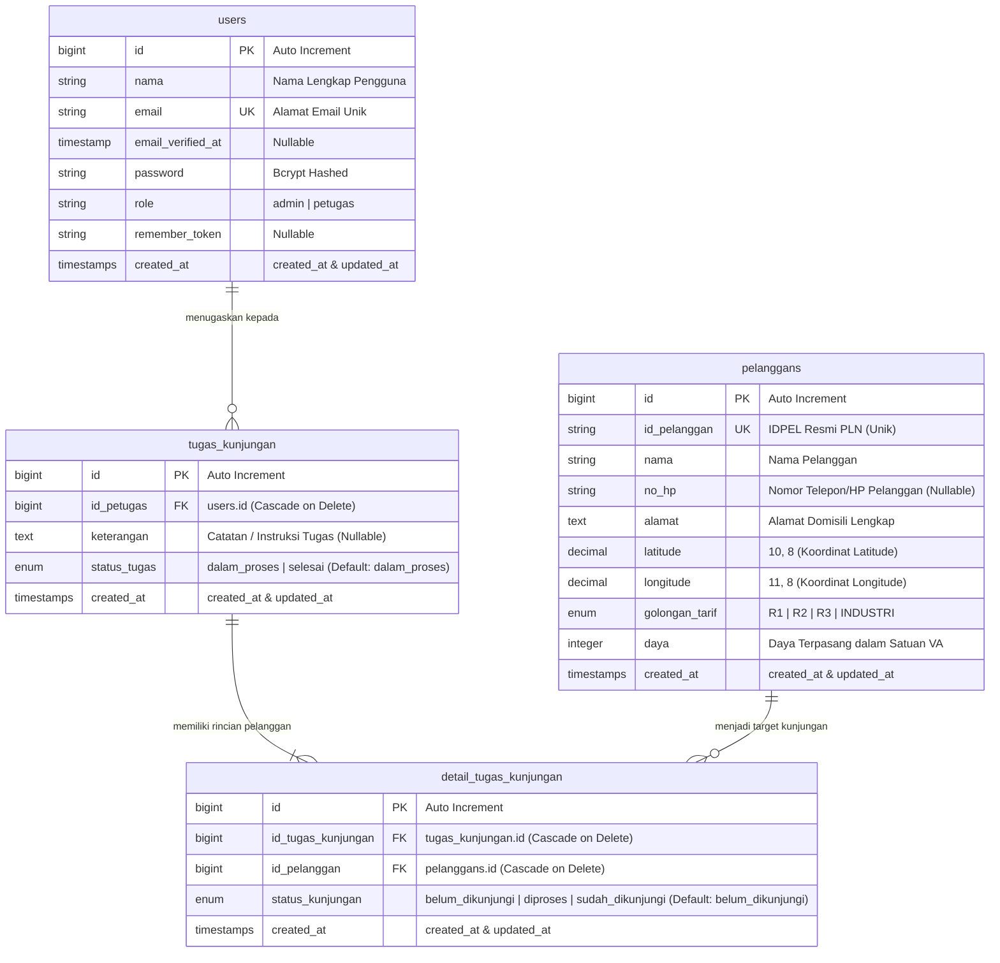

# Skema Basis Data & Relasi Model

Dokumen ini mendokumentasikan skema database relational (MySQL), diagram ERD, tipe data kolom, indeks performa, serta relasi model Eloquent ORM pada sistem **Pemetaan Pelanggan PLN**.

---

## 1. Diagram Relasi Entitas (ERD)

---

## 2. Kamus Data & Spesifikasi Tabel

### 2.1. Tabel `users`
Menyimpan kredensial otentikasi akun Admin dan Petugas Lapangan.
- `id` (BIGINT, PK, AI)
- `nama` (VARCHAR 255): Nama pengguna.
- `email` (VARCHAR 255, UNIQUE): Email login.
- `password` (VARCHAR 255): Password hash bcrypt.
- `role` (VARCHAR 50): Hak akses (`admin` atau `petugas`).

### 2.2. Tabel `pelanggans`
Menyimpan master data pelanggan listrik PLN, informasi daya, serta koordinat geografis.
- `id` (BIGINT, PK, AI)
- `id_pelanggan` (VARCHAR 255, UNIQUE, INDEX): Nomor ID Pelanggan (IDPEL).
- `nama` (VARCHAR 255, INDEX): Nama pemilik meteran/rekening.
- `no_hp` (VARCHAR 20, NULLABLE): Nomor telepon/WhatsApp aktif pelanggan.
- `alamat` (TEXT): Alamat lokasi fisik pemasangan listrik.
- `latitude` (DECIMAL 10,8, INDEX): Koordinat lintang.
- `longitude` (DECIMAL 11,8, INDEX): Koordinat bujur.
- `golongan_tarif` (ENUM: `'R1', 'R2', 'R3', 'INDUSTRI'`, INDEX): Kategori tarif.
- `daya` (INT, INDEX): Besaran kapasitas daya dalam Volt Ampere (VA) (misal: 900, 1300, 2200, 5500, dll.).

### 2.3. Tabel `tugas_kunjungan`
Menyimpan berkas penugasan inspeksi yang didelegasikan oleh Admin kepada Petugas Lapangan.
- `id` (BIGINT, PK, AI)
- `id_petugas` (BIGINT, FK -> `users.id`): Petugas lapangan penanggung jawab.
- `keterangan` (TEXT, NULLABLE): Instruksi penugasan dari Admin.
- `status_tugas` (ENUM: `'dalam_proses', 'selesai'`): Status keseluruhan paket tugas.

### 2.4. Tabel `detail_tugas_kunjungan`
Menghubungkan paket tugas kunjungan dengan pelanggan-pelanggan target (*pivot table with status*).
- `id` (BIGINT, PK, AI)
- `id_tugas_kunjungan` (BIGINT, FK -> `tugas_kunjungan.id`): Induk tugas.
- `id_pelanggan` (BIGINT, FK -> `pelanggans.id`): Target pelanggan.
- `status_kunjungan` (ENUM: `'belum_dikunjungi', 'diproses', 'sudah_dikunjungi'`): Tahapan penanganan di lapangan.

---

## 3. Relasi Model Eloquent

- **`User`**:
  - `hasMany(TugasKunjungan::class, 'id_petugas')`: Seorang petugas dapat memiliki banyak tugas kunjungan.
- **`TugasKunjungan`**:
  - `belongsTo(User::class, 'id_petugas')`: Setiap penugasan dimiliki oleh satu petugas lapangan.
  - `hasMany(DetailTugasKunjungan::class, 'id_tugas_kunjungan')`: Satu penugasan menaungi banyak detail kunjungan pelanggan.
- **`DetailTugasKunjungan`**:
  - `belongsTo(TugasKunjungan::class, 'id_tugas_kunjungan')`: Menginduk ke satu tugas kunjungan.
  - `belongsTo(Pelanggan::class, 'id_pelanggan')`: Mengacu ke satu data master pelanggan.
- **`Pelanggan`**:
  - `hasMany(DetailTugasKunjungan::class, 'id_pelanggan')`: Satu pelanggan dapat memiliki histori di berbagai penugasan kunjungan.
